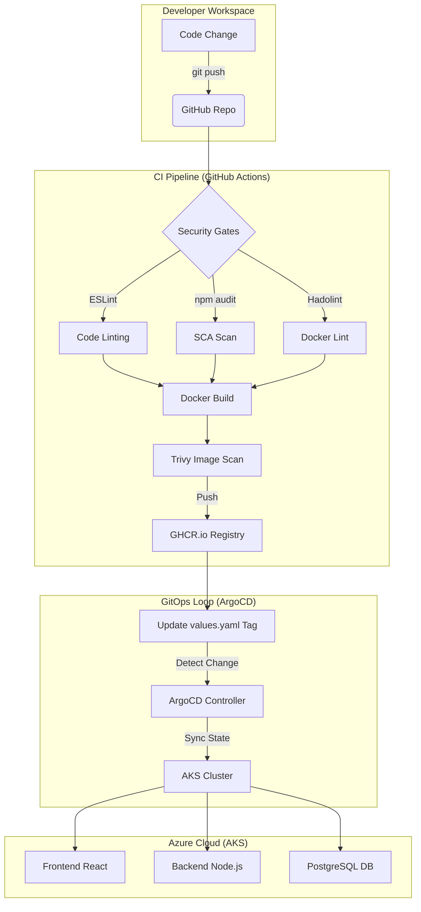

# 🛤️ Jerney — Blog Platform (Enterprise DevSecOps Edition)

A Gen-Z vibe blog platform built with a robust 3-tier architecture, fully automated via GitOps and secured with a modern DevSecOps pipeline.


---

## 🏗️ Architecture & Workflow

This project demonstrates a complete **Infrastructure-as-Code (IaC)** and **GitOps** lifecycle. When a developer pushes code, the following automated workflow triggers:

### 🛡️ DevSecOps Lifecycle (The "Inner & Outer Loop")



---

## 🚀 Key Features

- **Infrastructure as Code**: Entire Azure environment (AKS, VNet, Log Analytics) managed via **Terraform**.
- **GitOps Management**: **ArgoCD** ensures the cluster state always matches the repository. No manual `kubectl apply` needed.
- **Automated Security**: 
    - **SCA**: Dependency auditing via `npm audit`.
    - **Image Scanning**: Critical/High vulnerability detection via **Trivy**.
    - **IaC Scanning**: Security best practices for Terraform/Helm via **Checkov**.
- **Cloud Native Storage**: Dynamic provisioning of Azure Managed Disks (CSI) for persistent PostgreSQL storage.

---

## 📁 Project Structure

```text
Jerney/
├── .github/workflows/   # DevSecOps CI/CD Pipeline
├── backend/             # Node.js Express API
├── frontend/            # React (Vite) frontend
├── k8s-chart/           # Helm Chart for the entire 3-tier app
├── terraform/           # Azure Infrastructure (AKS + ArgoCD)
└── jerney-argocd-app.yaml # ArgoCD Application Manifest
```

---

## 🛠️ Setup & Deployment

### Phase 1: Infrastructure
Provision the Azure environment and ArgoCD:
```bash
cd terraform
terraform init
terraform apply -auto-approve
```

### Phase 2: GitOps Activation
Connect the GitHub repository to your cluster:
```bash
az aks get-credentials --resource-group jerney-aks-rg --name jerney-aks
kubectl apply -f jerney-argocd-app.yaml
```

---

## 📡 API Endpoints

| Method | Endpoint | Description |
|--------|----------|-------------|
| GET | `/api/health` | Health check |
| GET | `/api/posts` | Get all posts |
| POST | `/api/posts` | Create a new post |

---

Built with 💜 and strictly enforced security gates. No cap, this infrastructure hits different. 🛤️
